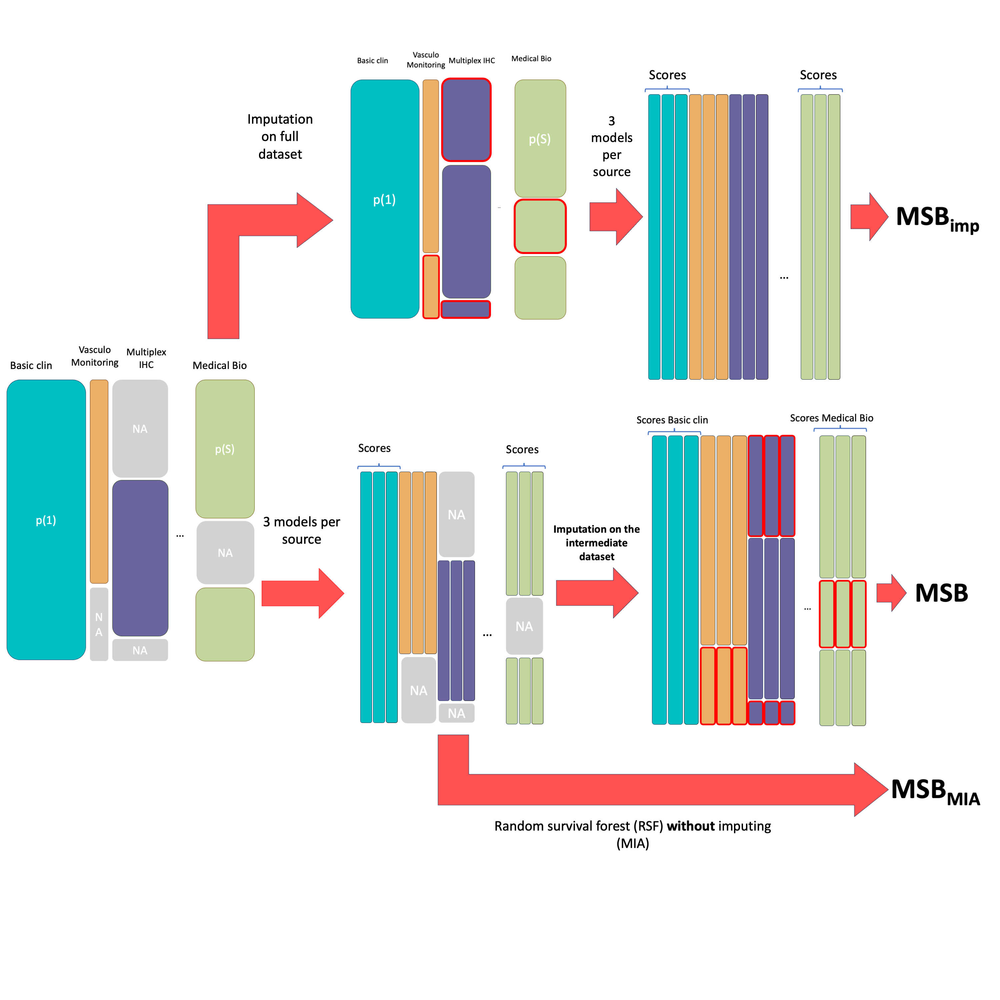

# MSB

Multimodality Stacking with Blockwise Missing Values

## Overview

The **MSB (Multimodality Stacking with Blockwise Missing Values)** package is designed for **survival analysis** in multimodal datasets with blockwise missing values. It integrates predictions from multiple modality-specific base learners and stacks them with a meta-learner to improve predictive performance.




## Installation

Clone the repository and install the package in editable mode:

```bash
cd msb_package
pip install -e .
```

## Quick Start

Here's a simple example showing how to use MSB for survival analysis with multimodal data:

```python
import pandas as pd
import numpy as np
from sksurv.ensemble import ComponentwiseGradientBoostingSurvivalAnalysis
from sksurv.linear_model import CoxnetSurvivalAnalysis
from MSB_package.msb_package import MSB
from sklearn.model_selection import train_test_split
from sklearn.impute import KNNImputer
from sklearn.pipeline import Pipeline

# 1. Prepare your data
X = pd.DataFrame({
    'age': np.random.uniform(40, 80, 100),
    'bmi': np.random.uniform(20, 35, 100),
    'gene_A': np.random.normal(0, 1, 100),
    'gene_B': np.random.normal(0, 1, 100)
})
X.index.name = 'SUBJID'

# Create survival target (structured array with Status and Survival_in_days)
risk_score = (0.05 * age) + (0.8 * gene_a)
time = np.exp(5 - 0.1 * risk_score) + np.random.normal(0, 2, n_samples)
time = np.maximum(time, 1)  # Ensure positive time
status = np.random.choice([True, False], n_samples, p=[0.8, 0.2])

X = pd.DataFrame({
    'age': age, 'bmi': bmi, 
    'gene_A': gene_a, 'gene_B': gene_b
})
X.index.name = 'SUBJID'

# Introduce Blockwise Missingness (30% of patients missing genomics)
X.iloc[70:, 2:] = np.nan 
X.iloc[:35, :2] = np.nan 
# Format target for sksurv
y = np.array([(s, t) for s, t in zip(status, time)],
             dtype=[('Status', 'bool'), ('Survival_in_days', 'float')])

# 2. Define modality blocks
dict_block = pd.DataFrame([
    {'code': 'age', 'block': 'Clinical'},
    {'code': 'bmi', 'block': 'Clinical'},
    {'code': 'gene_A', 'block': 'Genomics'},
    {'code': 'gene_B', 'block': 'Genomics'}
])

# 3. Split data
X_train, X_test, y_train, y_test = train_test_split(X, y, test_size=0.2, random_state=42)

# 4. Initialize MSB with base learners and meta-learner
final_est = Pipeline([
    ('imp', KNNImputer().set_output(transform='pandas')),
    ('meta', ComponentwiseGradientBoostingSurvivalAnalysis())
])

msb_model = MSB(
    estimators=[
        ('cxgb', ComponentwiseGradientBoostingSurvivalAnalysis()),
        ('coxnet', CoxnetSurvivalAnalysis(fit_baseline_model=True))
    ],
    final_estimator=final_est,
    dict_block=dict_block,
    blocks=['Clinical', 'Genomics'],
    folds=3,
    id_name='SUBJID',
    impute=True
)

# 5. Train and evaluate
msb_model.fit(X_train, y_train)
train_score = msb_model.score(X_train, y_train)
test_score = msb_model.score(X_test, y_test)

print(f"Train Concordance Index: {train_score:.3f}")
print(f"Test Concordance Index:  {test_score:.3f}")

# 6. Predict survival functions
surv_funcs = msb_model.predict_survival_function(X_test.head(2))
```

## Key Features

- **Multimodal Integration**: Combine multiple data modalities (clinical, genomics, imaging, etc.)
- **Blockwise Missing Values**: Handles missing data patterns where entire feature blocks are missing for some subjects
- **Ensemble Stacking**: Uses multiple survival base learners that are combined via a meta-learner
- **Automatic Imputation**: Optional KNN imputation for missing values
- **Survival Analysis**: Outputs concordance index for model evaluation and survival functions for predictions

## Parameters

### MSB Class

- `estimators`: List of (name, estimator) tuples for base learners
- `final_estimator`: Meta-learner for combining base learner predictions
- `dict_block`: DataFrame defining feature-to-block mappings
- `blocks`: List of block names to use
- `folds`: Number of cross-validation folds
- `id_name`: Column name for subject IDs
- `impute`: Whether to apply imputation for missing values

## Example Results

From the included example notebook:
- **MSB Model**: Train Concordance Index: 0.806, Test Concordance Index: 0.761
- **Baseline (Single Learner)**: Train Concordance Index: 0.796, Test Concordance Index: 0.712

## License

See LICENSE file for details.

## Citation

If you use MSB in your research, please cite this package.

## Documentation

For more detailed documentation and additional examples, see the `MSB_package/examples/` directory.
